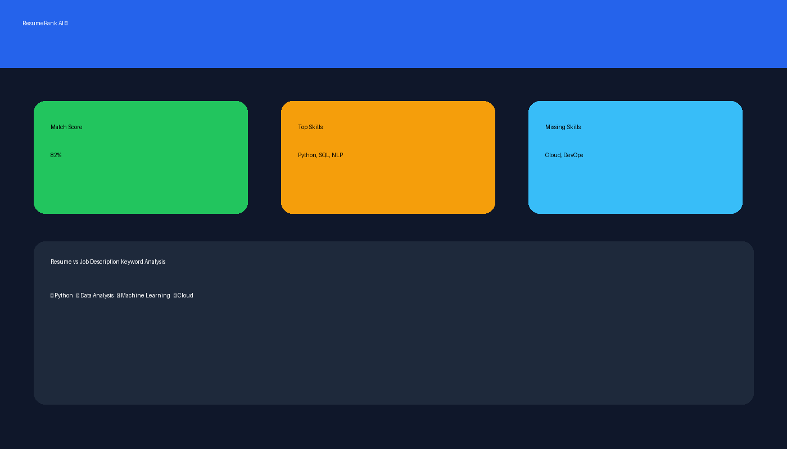

<div align="center">




# 🚀 **ResumeRank AI**
### *Smart Resume Matching • ATS-style Screening • Explainable AI*

</div>

---

## ✨ What is ResumeRank AI?
**ResumeRank AI** is a colorful, interactive AI-powered tool that evaluates how well a resume matches a job description.  
It simulates **ATS-style resume screening** using NLP techniques and provides **clear, explainable match scores**.

Designed for **internships, learning, and demonstrations**, this project focuses on clarity over complexity.

---

## 🎯 Key Features
- 📄 Resume & Job Description similarity scoring  
- 🤖 NLP-based keyword matching (TF-IDF + Cosine Similarity)  
- 📊 Visual match score & skill insights  
- 🧠 Explainable AI logic (no black-box decisions)  
- 🌈 Clean and colorful Streamlit dashboard  

---

## 🛠 Tech Stack
- **Python**
- **Scikit-learn**
- **Natural Language Processing (NLP)**
- **Streamlit**
- **TF-IDF & Cosine Similarity**

---

## ▶ How to Run
```bash
pip install -r requirements.txt
streamlit run app.py
```

---

## 📌 Use Cases
- Internship & fresher portfolios  
- Understanding ATS-style screening  
- Learning NLP similarity techniques  
- Demonstrating AI in HR Tech  

---

## ⚠ Disclaimer
This project is created **for educational purposes only** and should not be used as a real hiring or decision-making system.

---

## 👨‍💻 Author
**Bhavishya Kaushik**  
B.Tech – Computer Science & Engineering (AI)

🌟 *If you like this project, don’t forget to star the repository!*
